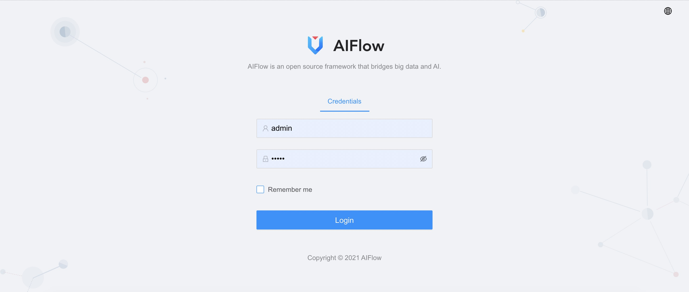

# Running AIFlow in Docker

This section will show you how to start AIFlow in docker container.

## Pulling Docker Image
Run following command to pull latest AIFlow docker image.
```shell script
docker pull flinkaiflow/flink-ai-flow:latest
```

## Starting AIFlow in Docker
Run following command to enter the docker container in interactive mode.
```shell script
docker run -it -p 8080:8080 -p 8000:8000 flinkaiflow/flink-ai-flow:latest /bin/bash
```

After entering docker container, run following command to start AIFlow.
```shell script
start-all-aiflow-services.sh
```

## Viewing Web Server

Once all servers started, you can visit the AIFlow Web [[http://127.0.0.1:8000](http://127.0.0.1:8000)] with the default username(admin) and password(admin):



Since Apache Airflow is the [Scheduler](../../architecture/overview.md) by default, you can visit the Airflow Web [[http://127.0.0.1:8080](http://127.0.0.1:8080)] 
with the default username(admin) and password(admin) to view the execution of workflows:


## What’s Next?
Now you can head to the [Example](./run_example.md) section to run a machine learning workflow with AIFlow.
